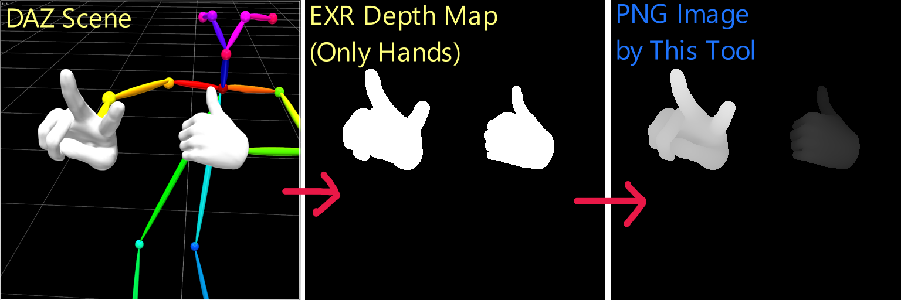
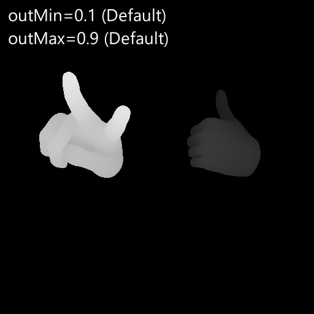

# AutoLevelEXR

## Description
* [日本語 README](./README_jp.md)
* This program auto levels EXR Depth Map obtained from DAZ3D and converts it into 8bit/16bit Grayscale PNG file.
  This program linearly stretchs the residual pixels' histgram **excluding pure black pixels** into the specified range ((0.1, 0.9) by default).

## How to Use
`main.py [--outMin OUTMIN] [--outMax OUTMAX] [--depth DEPTH] /path/to/DepthMap.exr`

If you use exe version, replace `main.py` by `autoLevelEXR.exe`.
Or just drag & drop EXR file onto autoLevelEXR.exe icon.

### Run Options
 - `--outMin <num>` : Min of Output Level range (0.0 - 1.0, default 0.1)
 - `--outMax <num>` : Max of Output Level range (0.0 - 1.0, default 0.9)
 - `--depth <num>` : Output grayscale's precision (bit) (8 or 16, default 8)

 

## Note
* The exe file in the release is made from main.py by use of pyinstaller.
 - Some minor AVSs with stupid heuristics may alert something somehow against such exe files.
   If you mind that, run main.py on your python environment instead of using exe file.
   That'd be safe because you can check what you'll run completely by yourself.

## License
BSD-3-clause
