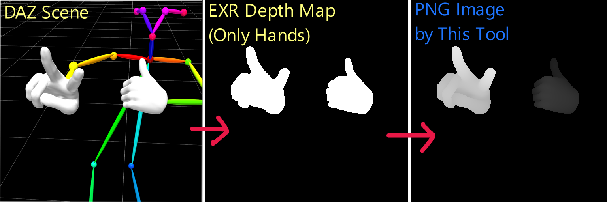
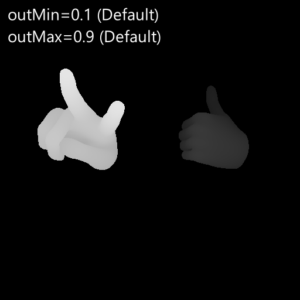
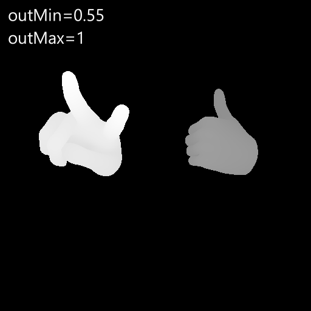

# AutoLevelEXR

## 概要
* [日本語 README](./README_jp.md)
* DAZ3D で出力した EXR Depth マップのレベル調整を行い、 8bit/16bit グレースケール の PNG ファイルに変換します。
  レベル調整としては、**完全な黒ピクセルを除いた** 残りのピクセルのヒストグラムを、指定した範囲(デフォルト(0.1, 0.9))に線形に伸縮させる処理を行います。

* 起動オプション
 - `--outMin <num>` : 出力レベルのレンジ下端 (0.0 - 1.0, default 0.1)
 - `--outMax <num>` : 出力レベルのレンジ上端 (0.0 - 1.0, default 0.9)
 - `--depth <num>` : 出力グレースケールの深度 (bit) (8 or 16, default 8)

 

## Note
* リリースの exe ファイルは pyinstaller を使って main.py から生成したものです。

## License
BSD-3-clause
This program makes use of OpenEXR.
